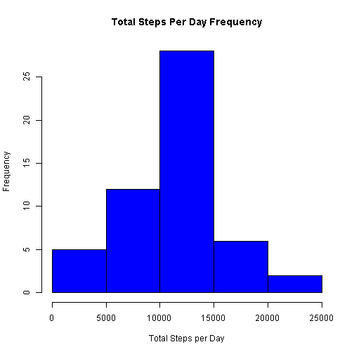
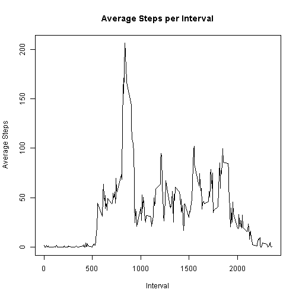
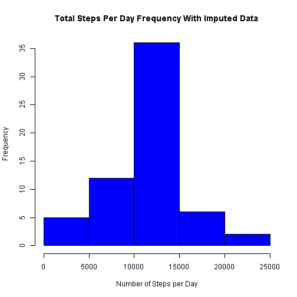
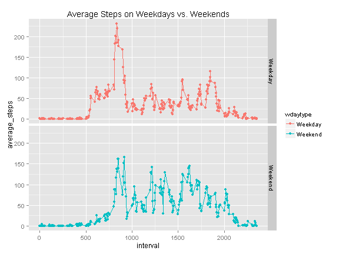
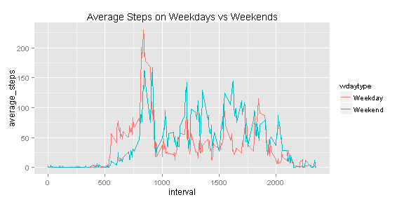

# Reproducible Research: Peer Assessment 1

## Loading and preprocessing the data


```r
     library(plyr)
     library(reshape2)
     library(ggplot2)
     options(scipen=100)
```

Show any code that is needed to

1) Load the data (i.e. read.csv())
  Assumes data in current working directory


```r
    df <- read.csv("activity.csv")
```

2) Transform the data into a format suitable for your analysis


```r
    df$date <- as.Date(df$date, "%Y-%m-%d")
```


## What is mean total number of steps taken per day?

For this part of the assignment, you can ignore the missing values in the dataset.

1) Calculate the total number of steps taken per day


```r
    df1a <- aggregate(df$steps ~ df$date, data=df, sum)
    df1b <- aggregate(df$steps ~ df$date, data=df, mean)
    colnames(df1a) <- c("date", "total_steps")
    colnames(df1b) <- c("date", "average_steps")
```


2) Make a histogram of the total number of steps taken each day


```r
    hist(df1a$total_steps, col="blue", xlab="Total Steps per Day",
         ylab="Frequency", main="Total Steps Per Day Frequency")
```

 


3)  Calculate and report the mean and median of the total number of steps taken per day


```r
    df1_mean <- round(mean(df1a$total_steps),0)
    df1_median <- round(median(df1a$total_steps),0)
```

**The mean of the total number of steps taken per day is 10766.**
**The median of the total number of steps taken per day is 10765.**


## What is the average daily activity pattern?


1) Make a time series plot (i.e. type = "l") of the 5-minute interval (x-axis) and the average number of steps taken, averaged across all days (y-axis)


```r
    df2a <- aggregate(df$steps ~ df$interval, data=df, mean)
    colnames(df2a) <- c("interval","average_steps")
    plot(df2a$interval, df2a$average_steps, type="l", 
         main="Average Steps per Interval", xlab="Interval", ylab="Average Steps")
```

 

2) Which 5-minute interval, on average across all the days in the dataset, contains the maximum number of steps?


```r
    max_row <- df2a[df2a$average_steps == max(df2a$average_steps),]
    max_interval <- max_row[1,1]
```

**Interval 835 contains the maximum average number of steps.**


    


## Imputing missing values

Note that there are a number of days/intervals where there are missing values (coded as NA). The presence of missing days may introduce bias into some calculations or summaries of the data.

1) Calculate and report the total number of missing values in the dataset (i.e. the total number of rows with NAs)


```r
    num_empty_rows <- nrow(df[is.na(df$steps),])
```

**The number of rows with missing values in the dataset is 2304.**


2) Devise a strategy for filling in all of the missing values in the dataset. The strategy does not need to be sophisticated. For example, you could use the mean/median for that day, or the mean for that 5-minute interval, etc.

Create a merged data set with the average steps in each interval as a column
Wherever there is an NA in steps, replace that NA with the corresponding interval average.


```r
     df3 <- merge(df, df2a, by="interval")
     for (i in row.names(df3[is.na(df3$steps),])) {df3[i,2] <- df3[i,4]}
```


3) Create a new dataset that is equal to the original dataset but with the missing data filled in.

Remove the added 4th column (average interval steps) to create the requested data set.


```r
    df4 <- df3[,1:3]
```

4) Make a histogram of the total number of steps taken each day and Calculate and report the mean and median total number of steps taken per day. Do these values differ from the estimates from the first part of the assignment? What is the impact of imputing missing data on the estimates of the total daily number of steps?


```r
    df4a <- aggregate(df4$steps ~ df4$date, data=df4, sum)
    colnames(df4a) <- c("date", "total_steps")
    hist(df4a$total_steps, col="blue", xlab="Number of Steps per Day",
         ylab="Frequency", main="Total Steps Per Day Frequency With Imputed Data")
```

 

```r
    df4a_mean <- round(mean(df4a$total_steps),0)
    df4a_median <- round(median(df4a$total_steps),0)
```

**The mean total number of daily steps after imputing values is 10766.**
**The median total number of daily steps after imputing values is 10766.**
**Given that both the mean and the median are the same or almost the same as prior to imputing values and the fact that the overall shape of the histogram is basically unchanged, it is safe to say that there is little impact of imputing missing data on this analysis.**


## Are there differences in activity patterns between weekdays and weekends?

For this part the weekdays() function may be of some help here. Use the dataset with the filled-in missing values for this part.

1) Create a new factor variable in the dataset with two levels <U+0096> <U+0093>weekday<U+0094> and <U+0093>weekend<U+0094> indicating whether a given date is a weekday or weekend day.


```r
    df4$date <- as.Date(df4$date, "%Y-%m-%d")
    df4$wday <- weekdays(df4$date)
    y1 <- row.names(df4[(df4$wday =="Sunday" | df4$wday == "Saturday"),]) 
    y2 <- row.names(df4[(df4$wday !="Sunday" & df4$wday != "Saturday"),])
    df4$wdaytype <- "NA"
    df4[y1,5] <- "Weekend"
    df4[y2,5] <- "Weekday"
    df4$wdaytype <- as.factor(df4$wdaytype)
    df5 <- aggregate (df4$steps ~ df4$interval + df4$wdaytype, data=df4, mean)
    colnames(df5) <- c("interval", "wdaytype", "average_steps")
```


2) Make a panel plot containing a time series plot (i.e. type = "l") of the 5-minute interval (x-axis) and the average number of steps taken, averaged across all weekday days or weekend days (y-axis). 


```r
    qplot(interval, average_steps, data=df5, color=wdaytype, facets= wdaytype ~ .) + 
         geom_line() + ggtitle("Average Steps on Weekdays vs. Weekends") 
```

 

**Or better yet - review the plots together:**


```r
     ggplot(data=df5, aes(x=interval, y=average_steps, group=wdaytype, colour=wdaytype)) + 
         geom_line() + ggtitle("Average Steps on Weekdays vs Weekends" ) 
```

 
